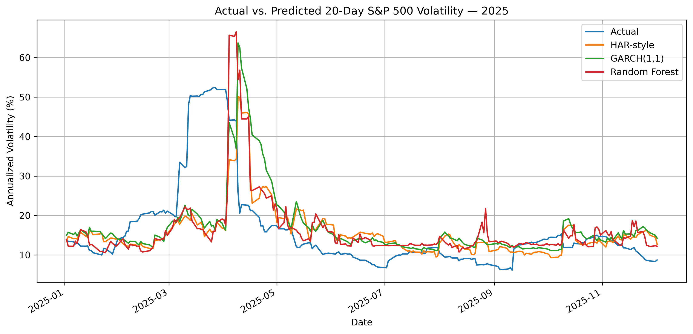
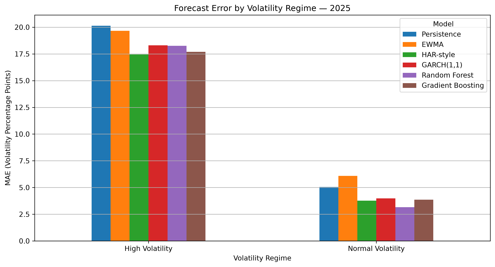

# S&P 500 Volatility Forecasting

**Forecasting near-term market risk with statistical and machine-learning models — and testing where those forecasts break down.**

[View the full analysis notebook](sp500_volatility_forecasting.ipynb)

## Project at a Glance

| | |
|---|---|
| **Business question** | Can statistical and machine-learning models improve 20-trading-day S&P 500 volatility forecasts, and how reliable are they during market stress? |
| **Market data** | SPY price/volume data and the CBOE Volatility Index (VIX) |
| **Forecast target** | Annualized realized volatility over the next 20 trading days |
| **Models compared** | Persistence, EWMA, HAR-style regression, GARCH(1,1), Random Forest, Gradient Boosting |
| **Validation** | 5-fold expanding-window time-series cross-validation with a 20-trading-day purge |
| **Final test** | Completely untouched 2025 observations |
| **Main finding** | No model wins every metric, and every model becomes much less accurate when volatility shifts sharply higher |

## Why This Project Matters

Volatility forecasts are used in market-risk monitoring, position sizing, derivatives, portfolio construction, and stress testing. A model can look accurate during normal markets while still underestimating risk when conditions deteriorate quickly.

This project therefore evaluates more than average forecast accuracy. It asks two questions:

1. **Which models forecast near-term volatility most accurately out of sample?**
2. **How do those models behave when the market enters a high-volatility regime?**

That second question becomes the most important result of the analysis.

## Headline Results

On the untouched 2025 test period, **Random Forest produced the lowest MAE**, **HAR-style regression produced the lowest RMSE**, and **GARCH(1,1) produced the best QLIKE score**.

| Model | Test MAE<br>(vol. pp) | Test RMSE<br>(vol. pp) | Test QLIKE |
|---|---:|---:|---:|
| **GARCH(1,1)** | 7.22 | 11.54 | **0.567** |
| **Random Forest** | **6.57** | 11.10 | 0.624 |
| **HAR-style regression** | 6.86 | **10.95** | 0.639 |
| Gradient Boosting | 6.98 | 11.23 | 0.641 |
| Persistence | 8.46 | 13.31 | 0.667 |
| EWMA | 9.16 | 13.18 | 0.733 |

**Interpretation:** there is no single universal winner. The best model depends on whether the priority is average absolute error, large-error control, or variance-forecast quality.

Random Forest reduced test MAE by approximately **22% versus the persistence benchmark**.

## The Most Important Finding: Models Struggle During Stress

The chart below compares actual 20-day realized volatility with the three strongest and most distinct model forecasts.



During the largest 2025 stress episode, realized 20-day volatility rose above **50% annualized**, while the leading forecasts remained mostly in the **mid-to-high teens**.

This is not just a one-model problem. All three leading approaches materially underpredicted the abrupt regime shift.

### Accuracy by Market Regime

The high-volatility regime is defined using the **75th percentile of the development-period target**, so the stress threshold is set without looking at the 2025 test outcomes.

| Model | High-volatility MAE | Normal-volatility MAE | High-volatility bias |
|---|---:|---:|---:|
| Persistence | 20.13 | 5.05 | -8.83 |
| EWMA | 19.66 | 6.09 | -9.70 |
| **HAR-style regression** | **17.45** | 3.77 | -11.60 |
| GARCH(1,1) | 18.30 | 3.98 | **-8.48** |
| **Random Forest** | 18.26 | **3.16** | -9.48 |
| Gradient Boosting | 17.97 | 3.77 | -9.88 |

*MAE and bias are shown in annualized volatility percentage points. Negative bias means the model underpredicted realized volatility.*

The 2025 test set contains **178 normal-volatility observations** and **52 high-volatility observations**.



Three conclusions stand out:

- **Random Forest is strongest in normal conditions**, with a 3.16-point MAE.
- **HAR-style regression has the lowest high-volatility MAE**, but still misses by 17.45 points on average.
- **GARCH has the smallest high-volatility underprediction bias** and the best QLIKE score, supporting its usefulness when variance estimation is the priority.

Most importantly, **every model's error rises sharply during stressed markets**.

## Cross-Validation Results

Model selection was based only on the development period. The final 2025 test set was not used to choose models or parameters.

| Model | CV MAE<br>(vol. pp) | CV RMSE<br>(vol. pp) | CV QLIKE |
|---|---:|---:|---:|
| Persistence | 6.10 | 8.61 | 0.607 |
| EWMA | 5.90 | 8.19 | 0.609 |
| **HAR-style regression** | **5.09** | 7.60 | 0.590 |
| **GARCH(1,1)** | 5.27 | **7.53** | **0.470** |
| Random Forest | 5.19 | 7.73 | 0.671 |
| Gradient Boosting | 5.51 | 8.33 | 0.702 |

The ranking changes somewhat in the final test period. That is exactly why the project keeps 2025 untouched until model development is complete.

## Methodology

### 1. Target Construction

The target is **annualized realized volatility over the following 20 trading days**.

`Future 20D volatility = sqrt(252 × average of the next 20 squared daily log returns)`

Squaring returns removes direction, so large positive and negative market moves both increase realized volatility. A value of `0.20` represents approximately **20% annualized volatility**.

### 2. Features

All predictors use information available on or before the forecast date:

- 1-day, 5-day, and 20-day SPY returns
- 5-day, 20-day, and 60-day realized volatility
- VIX level
- 1-day and 5-day VIX changes
- SPY intraday high-low range
- SPY volume change

### 3. Leakage Prevention

Time-series forecasting requires stricter validation than ordinary random train/test splitting.

This project uses:

- **Expanding-window cross-validation** so training always occurs before validation
- **252 trading days per validation fold**
- A **20-trading-day purge** between training and validation periods because the forecast target itself looks 20 days into the future
- A **fully untouched 2025 test period**

The purge prevents a training target near a fold boundary from using returns that belong to the validation or test period.

### 4. Evaluation Metrics

| Metric | Interpretation |
|---|---|
| **MAE** | Average size of the forecast error; easiest metric to interpret |
| **RMSE** | Penalizes large forecasting misses more heavily |
| **QLIKE** | Variance-focused loss function commonly used for volatility forecasts; lower is better |

Using all three prevents the analysis from declaring a winner based on only one definition of forecast quality.

## Models Compared

**Persistence** — assumes the next 20 days will have the same volatility as the previous 20 days. This establishes a simple benchmark.

**EWMA** — weights recent squared returns more heavily than older observations, allowing volatility estimates to respond more quickly to market changes.

**HAR-style regression** — combines short-, medium-, and longer-horizon realized volatility. The fitted model places the largest coefficient on 5-day volatility, indicating that recent conditions carry the strongest predictive weight in this specification.

**GARCH(1,1)** — models volatility as a persistent time-varying process. The fitted model estimates `alpha + beta ≈ 0.968`, indicating that volatility shocks decay slowly rather than disappearing immediately.

**Random Forest** — captures nonlinear relationships across returns, volatility, VIX, range, and volume features.

**Gradient Boosting** — builds sequential trees that attempt to correct previous prediction errors.

A major takeaway is that **additional model complexity does not automatically produce better forecasts**. HAR and GARCH remain highly competitive with the tree-based models.

## Risk-Management Interpretation

A volatility forecast answers:

> **What level of market risk appears most likely given current information?**

Stress testing asks a different question:

> **What happens if market conditions become much worse than the forecast?**

The 2025 results show why both approaches are necessary. Statistical and machine-learning forecasts provide useful baseline risk estimates, but sudden regime shifts can exceed those estimates by a wide margin.

This project therefore provides a natural foundation for a future **portfolio stress-testing project** using historical crisis scenarios, hypothetical shocks, VaR, and Expected Shortfall.

## Skills Demonstrated

- Financial time-series analysis
- Volatility and market-risk modeling
- Feature engineering from market data
- Expanding-window cross-validation
- Data-leakage prevention and purged validation
- Statistical modeling with HAR-style regression and GARCH
- Machine learning with Random Forest and Gradient Boosting
- Out-of-sample model comparison
- Regime and forecast-bias analysis
- Translating technical results into risk-management conclusions

## Limitations

- SPY is an investable proxy for the S&P 500 rather than the official S&P 500 Total Return Index.
- Realized volatility is calculated from daily returns rather than high-frequency intraday data.
- Forward 20-day targets overlap, so neighboring observations are correlated.
- The final test period covers one calendar year.
- GARCH uses normally distributed innovations in this specification.
- Tree-model hyperparameters are deliberately restrained rather than exhaustively optimized.
- No model is tuned using the final 2025 test results.

## Tools

`Python` · `pandas` · `NumPy` · `Matplotlib` · `yfinance` · `scikit-learn` · `arch`

## Repository Structure

```text
sp500-volatility-forecasting/
├── images/
│   ├── actual_vs_predicted_2025.png
│   └── regime_mae_2025.png
├── sp500_volatility_forecasting.ipynb
├── README.md
├── requirements.txt
└── .gitignore
```

## Reproduce the Analysis

1. Clone or download the repository.
2. Install the dependencies:

```bash
pip install -r requirements.txt
```

3. Open `sp500_volatility_forecasting.ipynb` in Jupyter.
4. Restart the kernel and run all cells from top to bottom.

The notebook downloads SPY and VIX market data programmatically through `yfinance`, so no raw market-data file is required in the repository.

## Data Sources

- **SPY** — investable proxy for the S&P 500
- **CBOE Volatility Index (`^VIX`)** — forward-looking market volatility indicator
- Historical market data downloaded programmatically through `yfinance`

---

**Portfolio takeaway:** the project demonstrates that forecast quality depends on both the model and the market regime. Models that perform well during normal conditions can still materially underestimate risk during abrupt volatility shocks — a key reason forecasting and stress testing should be used together.
